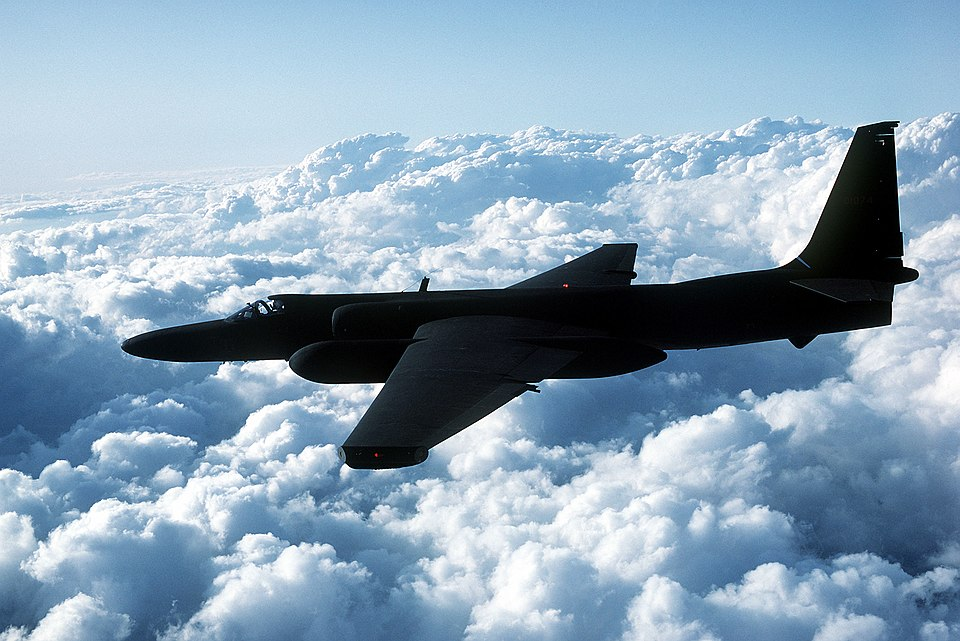

# `u2`: a Rust Authentication Library for U2F and FIDO2 &emsp; 

[![MIT licensed]][MIT] [![Apache-2.0 licensed]][APACHE]

<!--Description 	
English: [Original description] An air-to-air left side view of a TR-1 tactical reconnaissance aircraft.
The U-2 Dragon Lady is considered the leader among manned intelligence, surveillance and reconnaissance systems. An aircraft such as this collected images over the Gulf Coast region after Hurricanes Katrina and Rita.
Picture prepared for Wikipedia by Adrian Pingstone in April 2003.
Date 	between 1955 and 1998
Source 	Defense Visual Information Center (1998). A DoD CD-Rom Image Collection: Best of the US Air Force. [1][2]
Author 	United States Department of the Air Force
Permission
(Reusing this file) 	"Information presented on Airforce Link is considered public information and may be distributed or copied. Use of appropriate byline/photo/image credits is requested." [3]
https://commons.wikimedia.org/wiki/File:Usaf.u2.750pix.jpg
-->

⚠️ **CODE BARELY COMPILES**

⚠️ **CODE IS NOT TESTED**

⚠️ **DO NOT USE (YET)**

Forked from the [`u2f`](https://crates.io/crates/u2f) crate, which (as of this writing) has not been updated in years.

This is still a work in progress as I journey through the existing code and adapt it to use up-to-date dependencies, compile, test, and fit my style. I also have the ambition to not just cover U2F, but also the FIDO2 spec, but we'll see how that goes. ;)

[MIT licensed]: https://img.shields.io/badge/License-MIT-blue.svg
[MIT]: ./LICENSE-MIT
[Apache-2.0 licensed]: https://img.shields.io/badge/License-Apache%202.0-blue.svg
[APACHE]: ./LICENSE-APACHE

## Usage

[DO NOT USE...yet]

## Contributing

All constructive contributions are welcome!! Please raise an issue or make a pull request on GitHub. 

Please note that by contributing, you agree that your contribution(s) may be integrated into this project and dual-licensed in the same way which the overall project is. See [LICENSE](./LICENSE) for more information. 

### Goals

Here are some of the biggest challenges:

[ ] Audit the `u2::util::asn_length()` function, as it may or may not be doing its job correctly. 

[ ] Get this crate aligned with the U2F and FIDO2 standards.